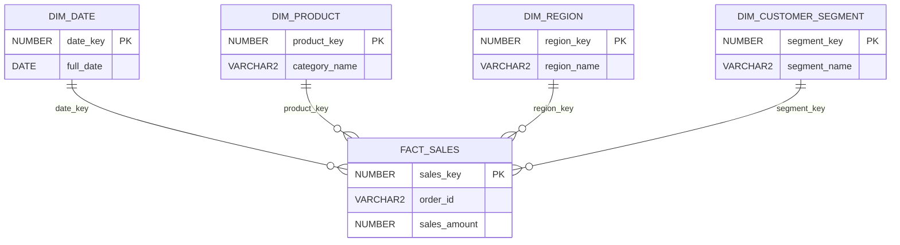

# Star schema diagram

```mermaid
erDiagram
  DIM_DATE ||--o{ FACT_SALES : date_key
  DIM_PRODUCT ||--o{ FACT_SALES : product_key
  DIM_REGION ||--o{ FACT_SALES : region_key
  DIM_CUSTOMER_SEGMENT ||--o{ FACT_SALES : segment_key
  DIM_DATE { NUMBER date_key PK DATE full_date }
  DIM_PRODUCT { NUMBER product_key PK VARCHAR2 category_name }
  DIM_REGION { NUMBER region_key PK VARCHAR2 region_name }
  DIM_CUSTOMER_SEGMENT { NUMBER segment_key PK VARCHAR2 segment_name }
  FACT_SALES { NUMBER sales_key PK VARCHAR2 order_id NUMBER sales_amount }
```
